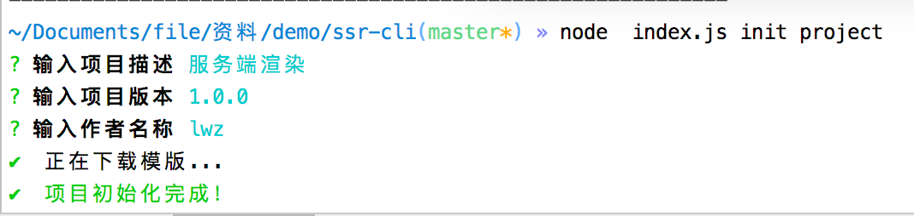

# ssr-cli
### 基于node快速生成服务端渲染(SSR)模版的脚手架工具搭建

----

#### 概述

像我们熟悉的vue-cli，react-native-cli等脚手架，只需要输入简单的命令```vue init wepack project```，即可快速帮我们生成一个初始项目。在实际工作中，我们可以快速指定一个属于自己的脚手架，来提高自己的工作效率。

为什么需要脚手架 ？

* 减少重复性的工作，不再需要复制其他项目再删除无关代码，或者从零创建一个项目和文件。
* 根据交互动态生成项目结构和配置文件等。
* 多人协作更为方便，不需要把文件传来传去。

####思路

要开发脚手架，首先要理清思路，脚手架是如何工作的？我们可以借鉴 vue-cli的基本思路。cue-cli是将项目模版放在git上，运行的时候再根据用户交互下载不同的模版，经过模版引擎渲染出来，生成项目。这样将模版和脚手架分离，久可以各字维护，即使模版有变动，只需要上传最新的模版即可，而不需要用户去更新脚手架就可以生成新的项目。那么就可以按照这个思路来进行开发了。

**第三方库**

首先来看看会用到哪些库

* commonder.js   可以自动的解析命令和参数，用于处理用户输入的命令。

* Download-git-repo.   下载并提取 git 仓库，用于下载项目模版。

* Inquirer.js    通用的命令行用户界面集合，用于和用户进行交互。

* Handlebars.js    模版引擎，将用户提交的信息动态填充到文件中。

* ora    下载过程久的话，可以用于显示下载中的动画效果。

* chalk。可以给终端的字体加上颜色。

* log-symbols    可以在终端上显示出 √ 或 × 等的图标。

    

#### 初始化项目

首先创建一个空项目，我们命名为ssr-cli，然后新建一个index.js文件，再执行npm init 生成一个package.json文件，最后安装上面的依赖。

``` javascript
$ npm install commander download-git-repo inquirer handlebars ora chalk log-symbols -S
```

#### 处理命令行

Node.js内置来对命令行操作的支持，在package.json中的 bin 字段可以定义命令名和关联的执行文件。所以现在在package.json中加上 bin 的内容：

```json
{
  "name": "ssr-cli",
  "version": "1.0.0",
  "description": "基于node快速生成服务端渲染(SSR)模版的脚手架工具",
  "main": "index.js",
  "scripts": {
    "test": "echo \"Error: no test specified\" && exit 1"
  },
  "bin": {
    "ssr-cli": "index.js"
  },
  "author": "lwz",
  "license": "ISC",
  "dependencies": {
    "chalk": "^2.4.2",
    "commander": "^2.19.0",
    "download-git-repo": "^1.1.0",
    "handlebars": "^4.0.12",
    "inquirer": "^6.2.1",
    "log-symbols": "^2.2.0",
    "ora": "^3.0.0"
  }
}

```

然后在index.js中来定义 init 命令：

```javascript
#!/usr/bin/env node
//在代码的开头第一行，必须指定我们的脚本执行所需要的解释程序。在这里，我们使用node来作为脚本的解释程序。
//而我们#! /usr/bin/env node这样写，目的是使用env来找到node，并使用node来作为程序的解释程序
const program = require('commander');

program.version('1.0.0', '-v, --version')
       .command('init <name>')
       .action((name) => {
           console.log(name);
       });
program.parse(process.argv);
```

调用```version('1.0.0', '-v, --version')```会将 -v 和 —version添加到命令中，可以通过这些选项打印出版本号。

调用 ```command('init <name>')```定义 init 命令，name 则是必传的参数，为项目名。

```action()```则是执行 init 命令会发生的行为，要生成项目的过程就是在这里面执行的，这里暂时只打印出 name。

其实到这里，已经可以执行行 init 命令了。我们来测试一下，进入srr-cli文件夹下执行：

```$ node index.js init project ```  

可以看到命令行工具也打印出了```project```，那么很清楚，```action(name => {})```这里的参数 name ，就是我们执行 init 命令时输入的项目名称。

命令已经完成，接下来就要下载模版生成项目结构了。

#### 下载模版

Download-git-repo 支持从Gitthub、Gitlab 和 Bitbucket 下载仓库，各自的具体用法可以参考官方文档。

```javascript
#!/usr/bin/env node
const program = require('commander');
const download = require('download-git-repo');

program.version('1.0.0', '-v, --version')
       .command('init <name>')
       .action((name) => {
           download('https://github.com:xxxxx/ssr_2#master', name, {clone: true}, (err) => {
                console.log(err ? 'Error' : 'Success')
           })
       });
program.parse(process.argv);
```

```dowanload()```第一个参数就是仓库地址，但是有一点点不一样。实际的仓库地址是```'https://github.com.xxxxx/ssr_2#master'```，可以看到```https://github.com```后面的'.'在参数中要写成':'

,```#master```代表的就是分支名，不同的模版可以放在不同的分支中，更改分支便可以实现下载不同的模版文件了。第一个参数还可以写成```direct:https://github.com.xxxxx/ssr_2.git```。第二个参数是路径，上面我们直接在当前路径下创建一个name 的文件夹存放模版，也可以使用二级目录比如 ```test/${name}```

#### 命令行交互

命令行交互功能可以在用户执行 init 命令后，向用户提出问题，接收用户的输入并作出相应的处理。这里使用 inrequirer.js来实现。

```javascript
const inquirer = require('inquirer');
inquirer.prompt([
    {
        type: 'input',
        name: 'author',
        message: '请输入作者名称'
    }
]).then((answers) => {
    console.log(answers.author);
})
```

通过这里例子可以看出，问题就放在 prompt中，问题的类型为 input 就是输入类型， name 就是作为答案对象中的key，message就是问题了，用户输入的答案就在 answers 中，使用起来就是这么简单。更多的参数设置可以参考官方文档。

通过命令行交互，获得用户的输入，从而可以把答案渲染到模板中。

#### 渲染模板

这里用 handlebars 的语法树对 lwz4070/ssr_2仓库的模板中的 package.json 文件做一些修改

```json
{
  "name": "{{name}}",
  "version": "{{version}}",
  "description": "{{description}}",
  "scripts": {
    "test": "echo \"Error: no test specified\" && exit 1"
  },
  "author": "{{author}}",
  "license": "ISC"
}
```

并在下载模板完成之后将用户输入的答案渲染到 package.json 中

```javascript
{
  "name": "{{name}}",
  "version": "1.0.0",
  "description": "{{description}}",
  "scripts": {
    "test": "echo \"Error: no test specified\" && exit 1"
  },
  "author": "{{author}}",
  "license": "ISC"
}
并在下载模板完成之后将用户输入的答案渲染到 package.json 中

program.version('1.0.0', '-v, --version')
.command('init <name>')
.action((name) => {
     // 命令行交互
    inquirer.prompt([
        {
            name: 'description',
            message: '输入项目描述'
        },
        {
            name: 'version',
            message: '输入项目版本'
        },
        {
            name: 'author',
            message: '输入作者名称'
        }
    ]).then((answers) => {
        download('xxxxx#master',name,{clone: true},(err) => {
            const meta = {
                name,
                description: answers.description,
                author: answers.author
            }
            const fileName = `${name}/package.json`;
            const content = fs.readFileSync(fileName).toString();
            const result = handlebars.compile(content)(meta);
            fs.writeFileSync(fileName, result);
        })
    })
});
```

这里使用了 node.js 的文件模块 fs，将 handlebars 渲染完后的模板重新写入到文件中。

#### 视觉美化

在用户输入答案之后，开始下载模板，这时候使用 ora 来提示用户正在下载中。

```javascript
const ora = require('ora');
// 开始下载
const spinner = ora('正在下载模板...');
spinner.start();

// 下载失败调用
spinner.fail();

// 下载成功调用
spinner.succeed();
```

然后通过chalk 来打印信息加上样式，比如成功信息为绿色，失败信息为红色，这样子会让用户更加容易分辨，同时也让终端的显示更加的好看。

```javascript
const chalk = require('chalk');
console.log(chalk.green('项目创建成功'));
console.log(chalk.red('项目创建失败'));
```

除了给打印信息加上颜色之外，还可以使用 log-symbols在信息前面加上 √ 或 × 等的图标。

```javascript
const chalk = require('chalk');
const symbols = require('log-symbols');
console.log(symbols.success, chalk.green('项目创建成功'));
console.log(symbols.error, chalk.red('项目创建失败'));
```

#### 完整示例

```javascript
#!/usr/bin/env node

//在代码的开头第一行，必须指定我们的脚本执行所需要的解释程序。在这里，我们使用node来作为脚本的解释程序。
//而我们#! /usr/bin/env node这样写，目的是使用env来找到node，并使用node来作为程序的解释程序

const fs = require('fs');
const program = require('commander'); // 用来自动的解析命令和参数，用于处理用户输入的命令
const download = require('download-git-repo'); //下载并提取git仓库，用于下载项目模版
const inquirer = require('inquirer'); //通用的命令行用户界面集合，用于和用户进行交互
const handlebars = require('handlebars'); //模版引擎，将用户提交的信息动态填充到文件中
const ora = require('ora'); //下载过程久的话，可以用于显示下载中的动画效果
const chalk = require('chalk'); //可以给终端的字体加上颜色
const logSymbols = require('log-symbols'); //可以在终端显示√ 或 X 等图标

program.version('1.0.0', '-v', '--version') //将 -v 和 --version 添加到命令中
    .command('init <name>')   // 定义 init 命令
    .action((name) => { //执行命令后所执行的方法。
        if (!fs.existsSync(name)) {
            // 命令行交互
            inquirer.prompt([
                {
                    name: 'description',
                    message: '输入项目描述'
                },
                {
                    name: 'version',
                    message: '输入项目版本'
                },
                {
                    name: 'author',
                    message: '输入作者名称'
                }
            ]).then((answers) => {
                const spinner = ora('正在下载模版...');
                spinner.start();
                download('https://github.com:lwz4070/ssr_2#master', name, {clone: true}, (err) => {
                    if (err) {
                        //下载失败
                        spinner.fail();
                        console.log(logSymbols.error,chalk.red(err));
                    } else {
                        //下载结束
                        spinner.succeed();
                        const meta = {
                            name,
                            description: answers.description,
                            version: answers.version,
                            author: answers.author
                        };
                        const fileName = `${name}/package.json`;
                        if (fs.existsSync(fileName)) {
                            // 读取package.json文件，将handlebars渲染后的模版重新写入到文件中
                            const content = fs.readFileSync(fileName).toString();
                            const result = handlebars.compile(content)(meta);
                            fs.writeFileSync(fileName, result);
                        }
                        console.log(logSymbols.success, chalk.green('项目初始化完成！'));
                    }
                });
            });
        } else {
            // 错误提示项目已存在，避免覆盖原有项目
            console.log(logSymbols.error, chalk.red('项目已存在'));
        }
    });
program.parse(process.argv); // program.parse 解析命令行参数argv
```



完成之后，就可以把脚手架发布到 npm 上面，通过 -g 进行全局安装，就可以在自己本机上执行 ```ssr-cli init [name] ```来初始化项目，这样便完成了一个服务端渲染 ssr-li 简单的脚手架工具了。


